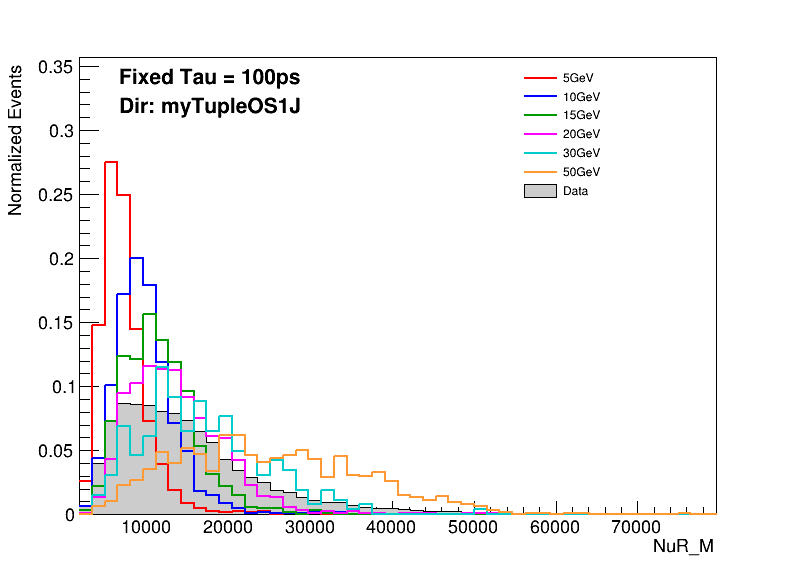
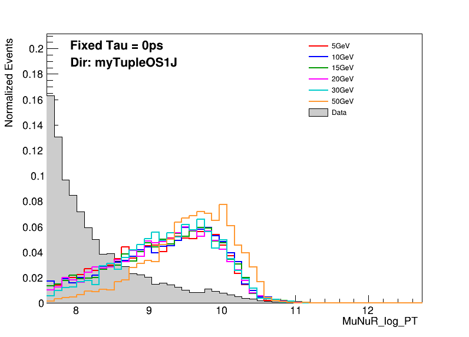
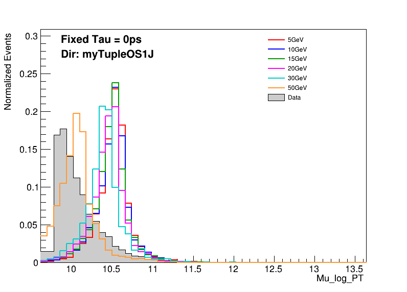
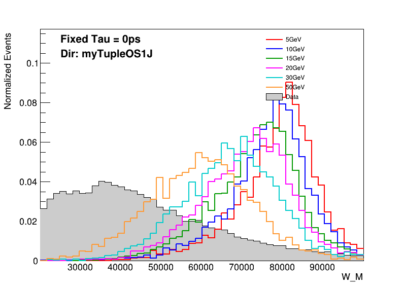
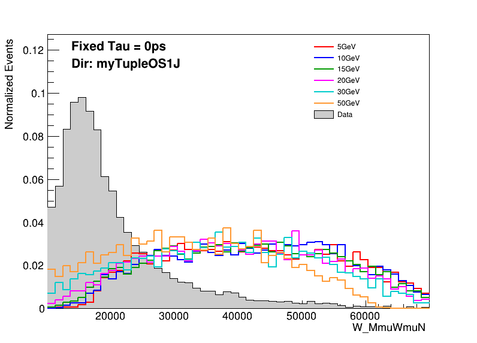

- 为什么质量的峰在大质量的时候没有出现到对应的位置？

- 都是与Mu相关的量为什么对应的本底是不同的，这是为什么？是否与两个Mu自身物理性质的表现相关？例如Mu_W动量更大但是Mu_N的动量更小？对应的本底分别是什么？

- W 质量峰左移问题？
    

- 这个物理量的含义到底是什么？感觉不是很懂，到底说的是哪个W的质量？？？

在机器学习的时候Mu_POSITION_STATEAT_LastMeasurement_Z 和 MuNuR_POSITION_STATEAT_LastMeasurement_Z 配合能够十分显著的区分本底与信号
并且少量数据的拟合效果就非常好？而且适用于所有相同directory的数据？

- 是否不应该使用重建的变量作为机器学习的输入以实现对于不同寿命质量N的普适性？
