# HNL 物理分析 - 变量与本底区分详解
# 42912010_5GeVCtau0ps_options_20260228_111712_skim.root

本文档详细解释了筛选出30物理量在 HNL (Heavy Neutral Lepton) 搜索分析中区分信号与本底的原理，以及 HNL 质量 ($M_N$) 和寿命 ($\tau_N$) 变化对这些变量分布的影响。

## 信号与本底的物理图像
**信号过程 ($W \to \mu_{W} N, N \to \mu_{NuR} q \bar{q}'$)**: 
  - 来源于重玻色子 ($W^\pm$, ~$80.4$ GeV) 的衰变。
  - **W Muon ($\mu_{W}$)**: $W$ 直接衰变产生，动量大。
  - **N Muon ($\mu_{NuR}$)**: 若 $N$ 为长寿命粒子，其飞离主顶点一段距离后衰变产生的 $\mu$
  - 特征：高能 (Hard)、低多重度 (Clean)、具有特定的共振峰 ($W, N$)、以及可能的顶点位移。

**本底过程**: 
  - 主要是 QCD 多喷注事件 ($b/c$ 夸克衰变)、普通 $W/Z$ 衰变伴随随机径迹、以及探测器假径迹 (Ghost)。
  - 特征：低能 (Soft)、高多重度 (Busy)、随机组合（无尖锐共振峰）。

---

## 1. W_M
**物理含义**: 利用 $\mu$ 和 N  的所有动量信息重建出的总不变质量。

**区分本底的原因**:
- **信号**: 能量守恒使得信号分布在 $W$ 质量 ($80.4 \text{ GeV}$) 附近形成明显的**峰**。
- **本底**: 由随机粒子组合而成，没有固定的质量来源，分布通常呈现**连续谱**（指数下降），且往往偏向低质量。

**质量与寿命的影响**:
- **长寿命 $N$ ($\tau$)**: 长寿命导致衰变顶点远离主顶点，且容易造成部分衰变产物能量丢失。但是为什么会左移呢？？？
- **大质量 $N$ ($M$)**: 大质量 $N$ 使得衰变产物运动学分布改变，可能导致重建的**峰宽增加**。同时由于产生截面下降，信号统计量减少，峰相对于本底的显著性降低。

## 2. W_MIN_PT / W_MAX_PT / W_log_MIN_PT / W_log_MAX_PT
**物理含义**: $W$ 衰变链中子粒子横动量 ($p_T$) 的最小值或最大值。

**区分本底的原因**:
- **信号**: 能量源头是极重的 $W$ 玻色子，即便是动量最小的产物，通常也比 QCD 本底中的动量要大。
- **本底**: 本底中常混杂低能的随机径迹或强子碎裂产物。

**质量与寿命的影响**:
- **寿命 ($\tau$)**: 影响较小。但极长寿命可能导致部分低 $p_T$ 粒子因接受度问题丢失。
- **大质量 $N$ ($M$)**:  $N$ 质量增大导致其产生截面减小，虽然其衰变产物动量变大，但 $\mu_{W}$ 动量减小，大质量 $N$ 实际上可能让最小 $p_T$ 分布向低能区移动，从而趋向于本底。

  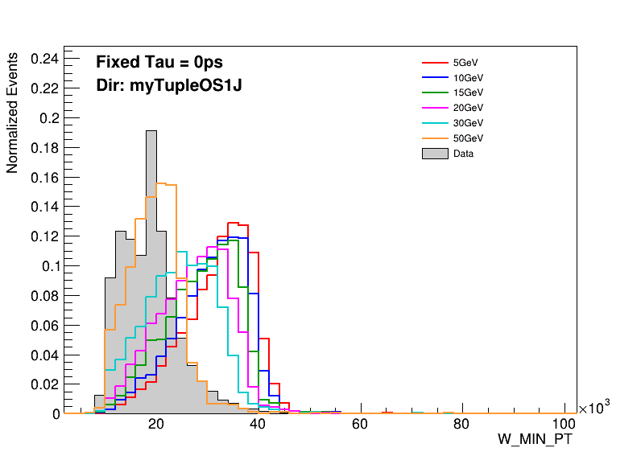
  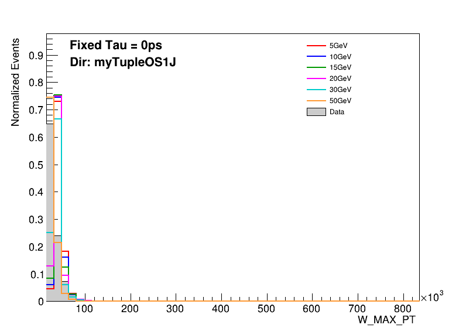
  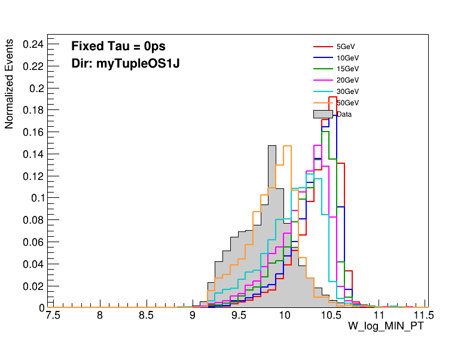
  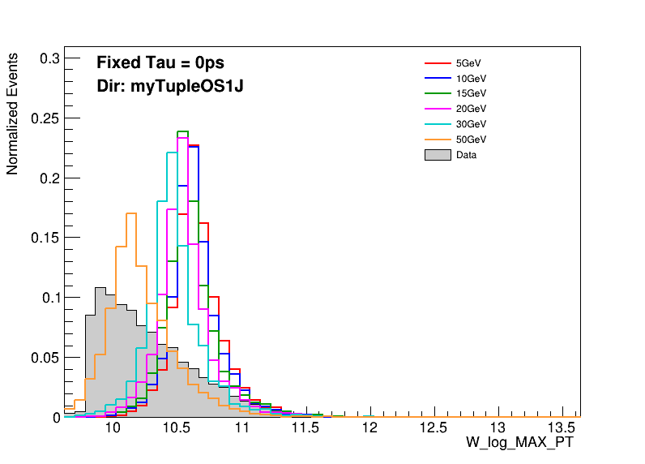

## 3. Mu_PT / Mu_log_PT / Mu_TRACKPT ( $\mu$ 的横动量)
**物理含义**: $N$ 产生时刻伴随的那颗 $\mu$  的横动量。

**区分本底的原因**:
- **信号**: 携带了 $W$ 衰变的大部分能量，是典型的高能（Hard）轻子， $30-40$ GeV。
- **本底**: 主要来自 $b/c$ 衰变，动量较软（通常 $<10$ GeV）。

**质量与寿命的影响**:
- **寿命 ($\tau$)**: 无影响。
- **大质量 $N$ ($M$)**: 随着 $N$ 变重，导致其动量**变软**，分布左移，这就是为什么大质量 HNL 信号更难与本底区分（**趋于本底**）。

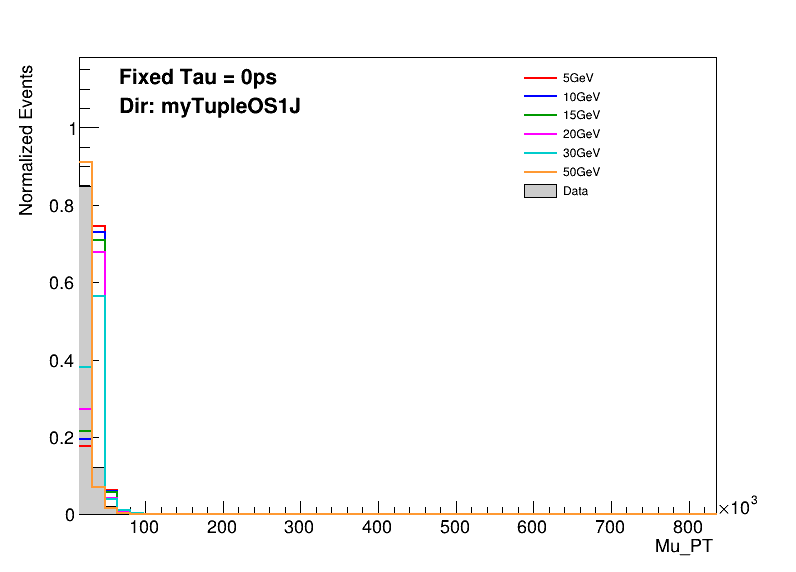
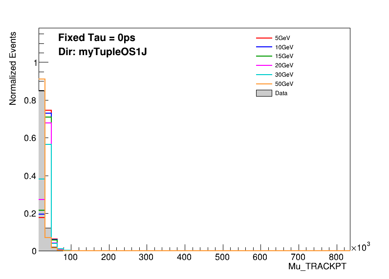

## 4. W_log_SUM_PT
**物理含义**: 事件总横动量之和的对数。

**区分本底的原因**: 反映了物理过程的能量标度。信号是高能，本底是低能。与 `Mu_PT` 类似，大质量 $N$ 会略微改变其分布形状。
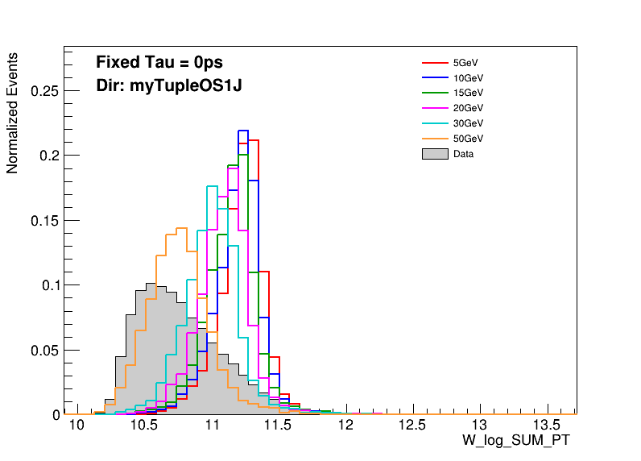

## 5. W_MmuWmuN ($\mu_{W}$ 与 $\mu_{N}$ 的组合质量, 存疑？)
**物理含义**:  $\mu_{W}$ 和 $\mu_{N}$ 组成的双子系统的“反冲质量”或部分质量???

<!-- **区分本底的原因**:
- **信号**: 对于三体衰变或级联衰变，双轻子质量谱有特定的运动学边界，由 $M_W$ 和 $M_N$ 决定。
- **本底**: 把两个随机的 $\mu$（或者一个是假 $\mu$）组合起来，其质量分布没有这种明确的边界，通常平滑下降。

**质量与寿命的影响**:
- **大质量 $N$ ($M$)**: 直接改变了运动学边界的位置，使得该变量的分布范围和形状发生显著变化。 -->

## 6. MuNuR_PT / MuNuR_log_PT / MuNuR_TRACKPT ($\mu_{N}$ 的横动量)
**物理含义**: 这里的 `MuNuR` 特指 $N$ 衰变产生的那个子 ($\mu_{N}$)。

**区分本底的原因**:  $N$ 的衰变产物也具有较高的动量，区别于低能本底。

**质量与寿命的影响**:
- **寿命 ($\tau$)**: 影响较小。
- **大质量 $N$ ($M$)**: $N$ 越重，其静止质量释放的能量越多，导致 $\mu_{NuR}$ 的动量**更大**（Harder），这与 `Mu_PT` 随质量变大而变软的趋势相反。

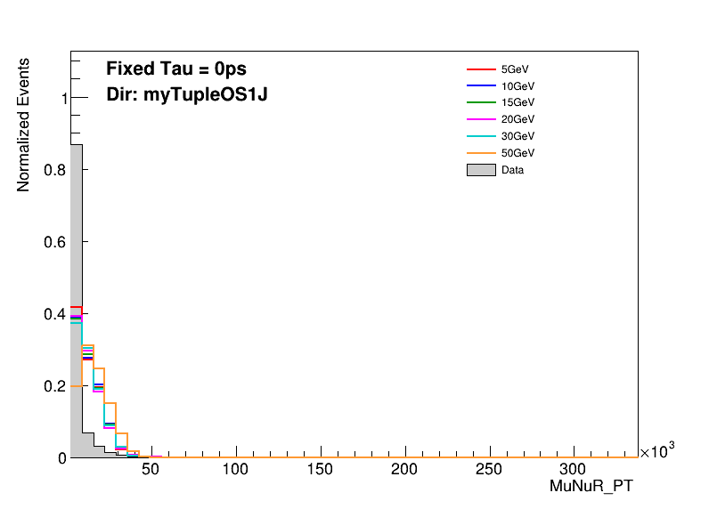

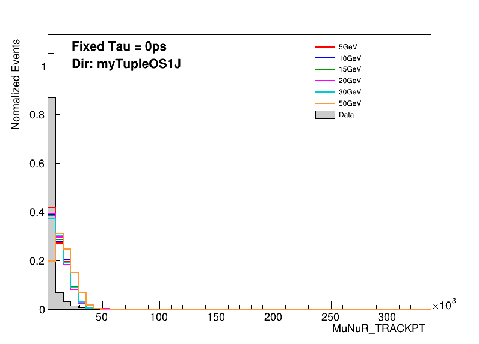

## 7. NuR_ALV (N 的飞行方向指向性)
**物理含义**: 衡量重建的 $N$ 动量方向与 $N$ 的飞行路径。

**区分本底的原因**:
- **信号**: 真实的 $N$ 是一个飞行一段距离后衰变的粒子，动量守恒要求其动量方向必须沿着飞行方向（ALV $\approx 1$）。
- **本底**: 假顶点是随机径迹交叉形成的，其“飞行方向”没有物理意义，与动量方向无关联，ALV 分布杂乱。

**质量与寿命的影响**:
- **大质量 $N$**: 速度降低，衰变张角变大，导致指向性分辨率略微变差（分布展宽）。

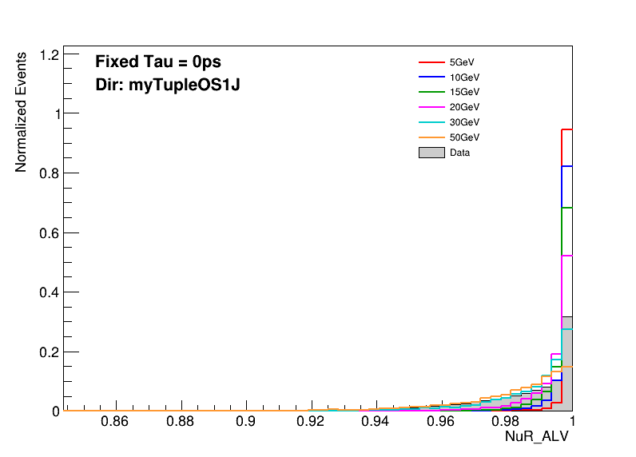

## 8. NuR_M (重建的 N 质量)
**物理含义**: 重建出的 $N$ 候选者 ($\mu_{N} + \text{jets}$) 的不变质量。

**区分本底的原因**:
- **信号**: 在正确假设下，会在 $M_N$ 处形成**尖锐的峰**。
- **本底**: 杂乱组合，无峰值，平坦或下降分布。

**质量与寿命的影响**:
- **大质量 $N$**: 峰的位置右移。如果 $N$ 产生截面太小，信号峰会被大量的连续本底稀释及掩盖（**被本底稀释**）。
- **长寿命**: 如果衰变太远，部分径迹重建质量下降或某些产物丢失，会导致峰**分立**或展宽。

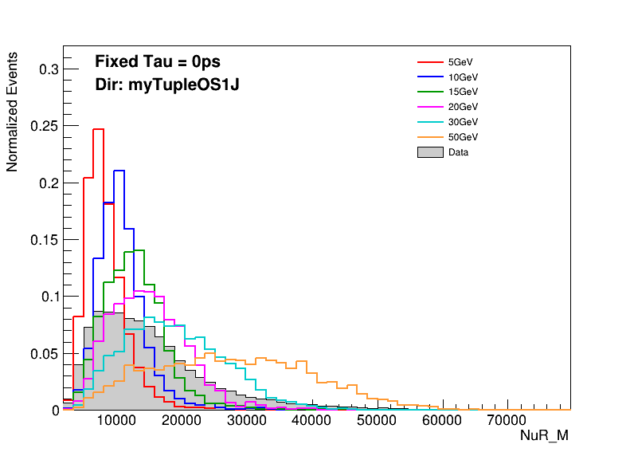

## 9. NuR_MIN_PT / NuR_log_MIN_PT
**物理含义**: $N$ 衰变产物中最小的横动量。

**区分原因**: 即便最软的产物，因来自重粒子 $N$，也比本底硬。

**质量影响**: 大质量 $N$ 释放更多能量，使得 `MIN_PT` 显著增大，峰值右移且更分立。

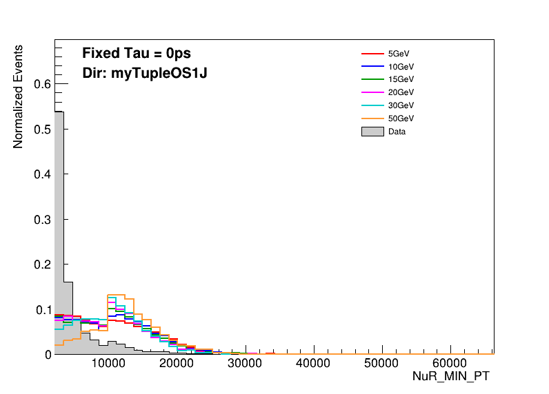
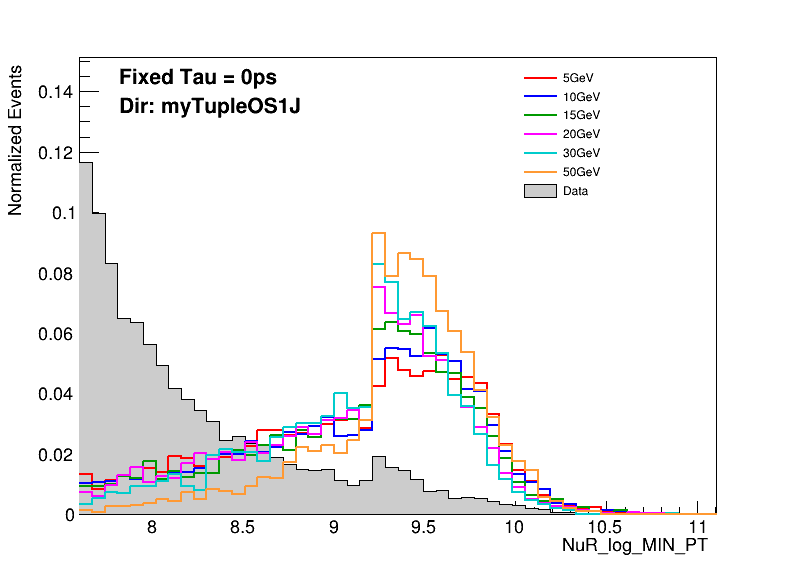

## NuR_PT / NuR_log_PT (N 的横动量)
**物理含义**: 重建的 $N$ 的横动量。
**区分原因**: $N$ 来自 $W$ 的衰变，具有较大的反冲动量，区别于低能本底。
**质量与寿命的影响**:
- **寿命 ($\tau$)**: 影响较小。
- **大质量 $N$ ($M$)**: 大质量 $N$ 的分到的动量更小，峰值左偏。

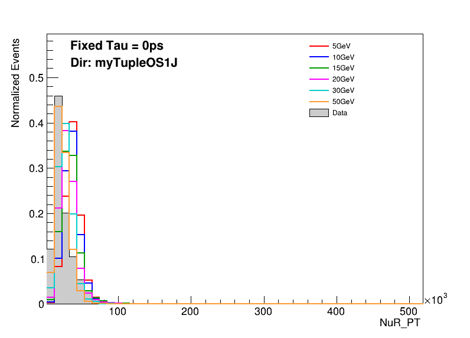
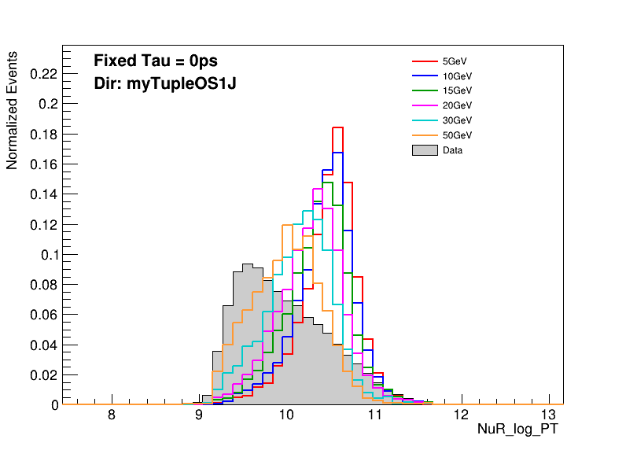

## 10. Mu_HCALEOP / Mu_ELECTRONSHOWEREOP (能量/动量比 E/P)
**物理含义**: 粒子在量能器中的沉积能量与动量之比。
**区分原因**:
- **信号 ($\mu$)**: 最小电离粒子 (MIP)，穿透力强，$E/P \approx 0$。
- **本底**: 电子 ($E/P \approx 1$) 或强子 (在 HCAL 沉积能量)，$E/P$ 值较大。
- **影响**: 与 $M_N, \tau$ 关系不大，主要取决于探测器 PID 性能。

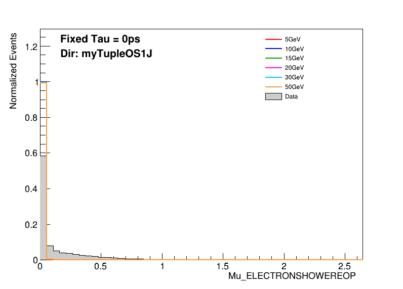
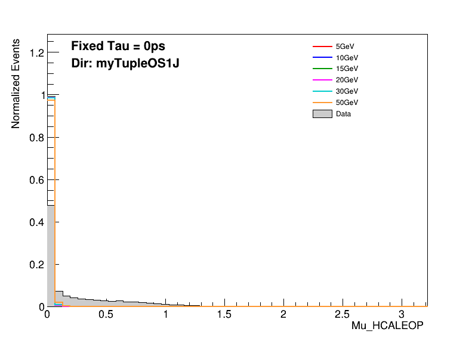

## 11. Mu_PROBNN_GHOST / Mu_PROBNN_MU / MuNuR_PROBNN_GHOST / MuNuR_PROBNN_MU 
**物理含义**: 神经网络判断径迹是假或真 Mu 的概率。
**区分原因**: 信号全是真 $\mu$ (Ghost概率低，Mu概率高)；本底含大量假径迹 (Ghost概率高)。
**影响**: 客观存在，随对撞环境变化，受物理参数影响小。

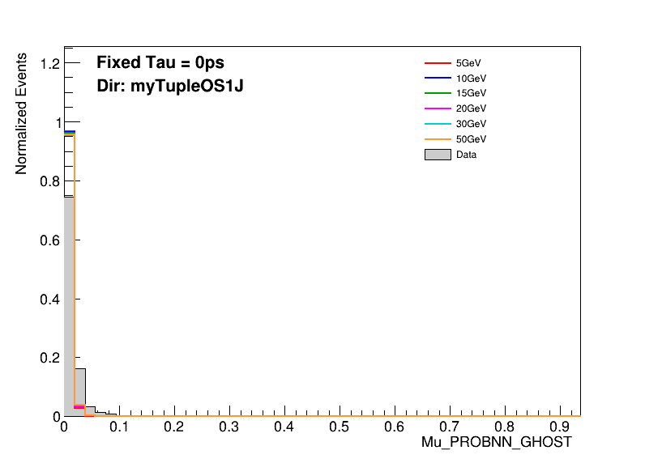
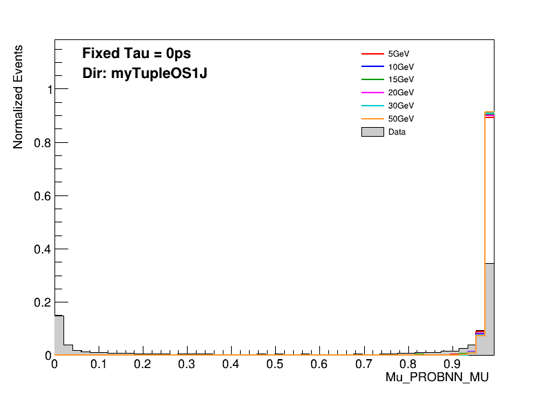
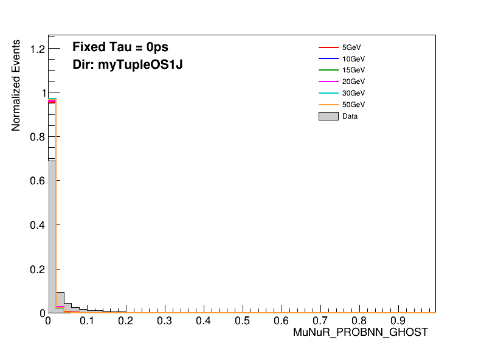
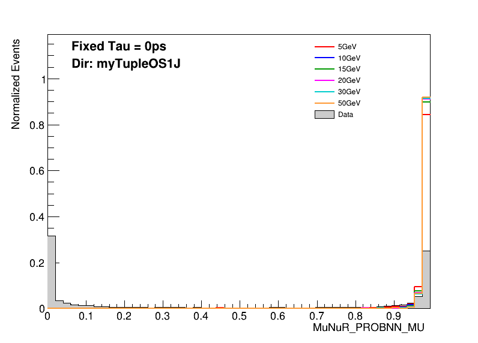

## 12. nFTClusters (光纤径迹探测器簇数)
**物理含义**: 光纤径迹探测器（FT）中记录到的信号簇总数，反映了该次对撞产生了多少带电粒子。

**区分原因**:
- **信号**: 电弱过程，相对少，簇数少。
- **本底**:  QCD 强相互作用喷注，产生大量粒子，簇数多。

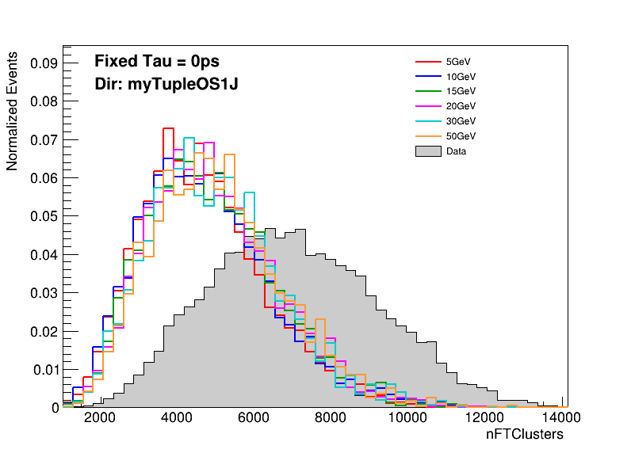

## 13. Mu_POSITION_STATEAT_LastMeasurement_Z\MuNuR_POSITION_STATEAT_LastMeasurement_Z
**物理含义**: $\mu$ 径迹最后测量点的 Z 坐标。

**区分原因**: 真 $\mu$ 穿透力强，能到达探测器最末端。本底（强子、假径迹）往往在中间就被吸收或中断。

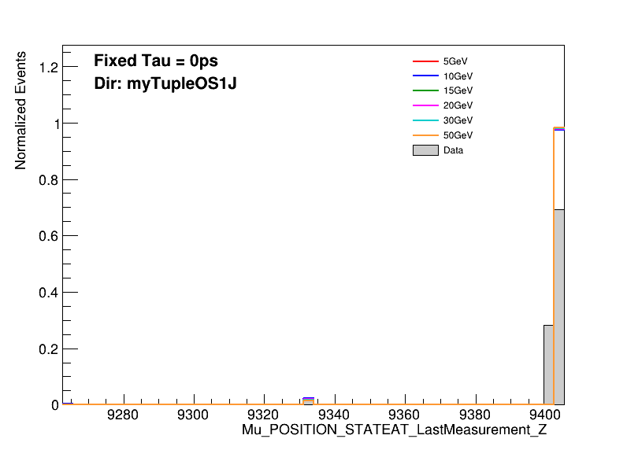
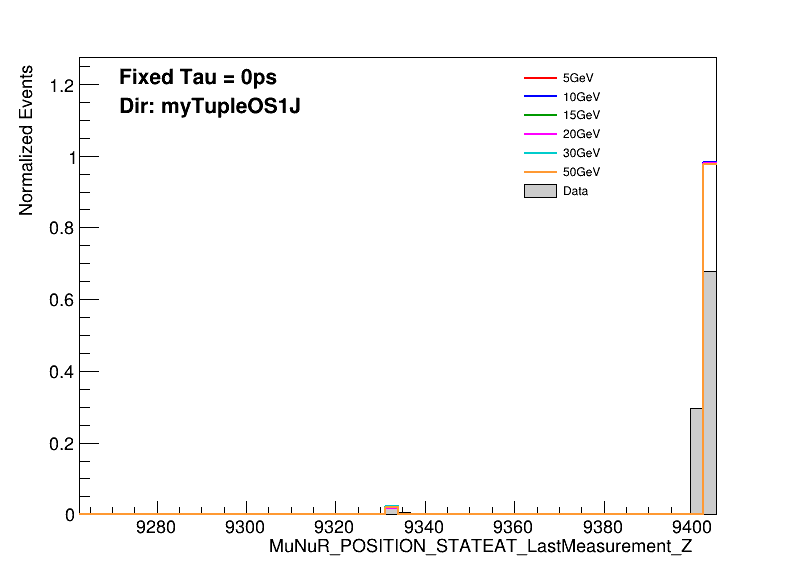

## 14. Mu_BREMTRACKBASEDENERGY
主要用于区分电子和Mu子。电子很轻，容易发生轫致辐射；子很重，几乎不发生。该变量有助于剔除电子本底
 跟寿命质量变化不大，但是跟本底的差距感觉也不算很大

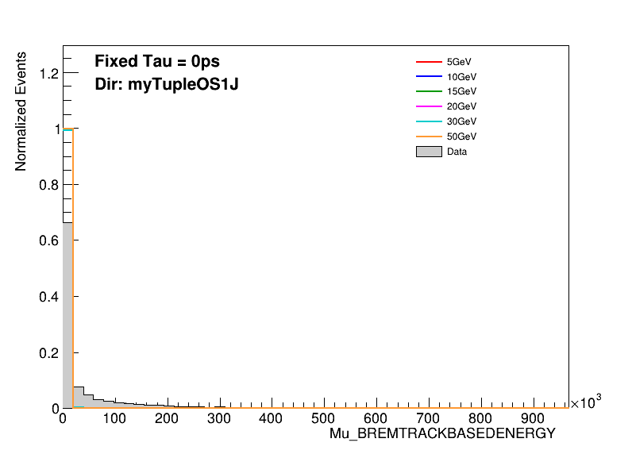
