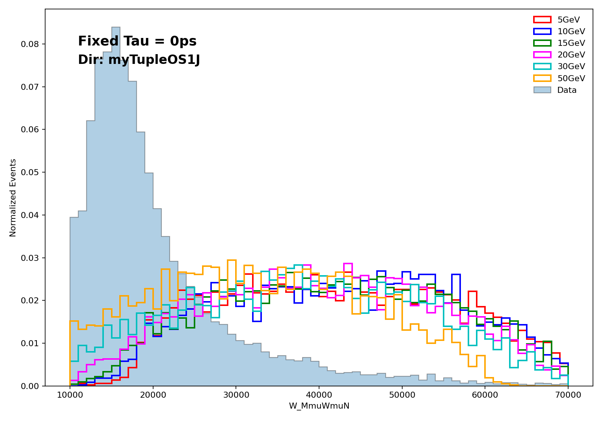
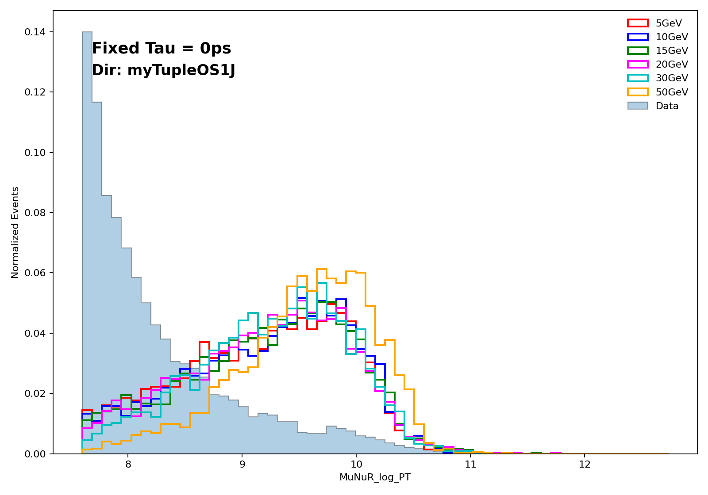

约定：四动量为 $(t,x,y,z)$，采用度规 $g^{\mu\nu}=\mathrm{diag}(+1,-1,-1,-1)$。

## HNL信号过程

  

### $p+p\to W^\pm\to l_\alpha^\pm+N$

实际上过程为 $u+\bar d\to W^+,\;d+\bar u\to W^-$。 $udW^-$ 的顶角因子为：

$$
i\dfrac{g}{\sqrt 2}V_{ud}\gamma^\mu P_L,\quad P_L=\dfrac{1-\gamma_5}{2}
$$

$V_{ud}$ 是CKM因子，该过程的振幅为

$$
\mathcal M\sim[\bar v_u\gamma^\mu P_L u_d]\dfrac{-i(g_{\mu\nu}-q_\mu q_\nu/m_W^2)}{s-m_W^2+im_W\varGamma_W}[\bar u_N\gamma^\nu P_Lv_\mu]
$$

考虑在共振极点附近的情形，此时可认为中间的 $W^\pm$ 是**在壳的**。将两个过程分开考虑：

$$
q_i(p_1)+\bar q_j(p_2)\to W
$$

则

$$
i\mathcal M=\bar v_j(p_2)\left(i\dfrac{g}{\sqrt 2}V_{ij}\gamma^\mu P_L\right)u_i(p_1)\varepsilon_\mu^*(k),\quad k=p_1+p_2
$$

其中 $\varepsilon_\mu^*(k)$ 为W的极化矢量。从动量守恒可以看出，初始时的pp只有纵向动量，那么 $W$ 也应该没有横向动量。实际的 $W$ 有横向动量可能是因为：

(a)原来的质子有横向动量。(b)真实的过程还可能是 $q\bar q'\to Wg$。胶子反冲赋予横向动量。

上面的振幅实际上只是极简化的结果，我们考虑的是 $pp\to W$ 过程，但实际的反应是Parton发生的。Parton的动量写为：

$$
p_1=x_1P_1,\quad p_2=x_2P_2
$$

总截面应该写为求和形式：

$$
\sigma(pp\to W)=\sum_{ij}\int_0^1\mathrm{d}x_1\int_0^1\mathrm{d}x_2\,f_{i}(x_1)f_j(x_2)\hat \sigma(q_i\bar q_j\to W)
$$

由于质子对撞时基本上满足 $p_1=-p_2$，且 $m_W\gg m_p\sim 0.938\,\mathrm{GeV}$。因此一般可以认为W是静止的。

再来考虑 $W$ 的衰变过程：

$$
W^+(k)\to \mu^+(p_1)+N(p_N)
$$

最低阶树图振幅为：

$$
i\mathcal M_1=i\dfrac{g}{\sqrt 2}V_{\mu N}\,\varepsilon_\mu(k)\bar u_N(p_N)\gamma^\mu P_Lv_l(p_l)
$$

一般而言，我们会对初态做极化平均，并对末态自旋求和：

$$
\langle|\mathcal M_1|^2\rangle=\dfrac13\sum_{i,s_\mu,s_N}\dfrac{g^2}{2}|V_{\mu N}|^2\varepsilon^{(i)}_\mu(k)\varepsilon^{(i)}_\nu(k)[\bar u_N\gamma^\mu P_Lv_l][\bar u_N\gamma^\nu P_Lv_l]^*
$$

矢量场与旋量场的完备性关系：

$$
\sum_i\varepsilon^{(i)}_\mu(k)\varepsilon^{(i)}_\nu(k)=-g_{\mu\nu}+\dfrac{k_\mu k_\nu}{m_W^2},\quad \sum_{s_N}u_N\bar u_N=p\mkern-8.5mu/_N+m_N,\quad \sum_{s_\mu}v_l\bar v_l=p\mkern-8.5mu/_l-m_\mu
$$

共轭项进一步写为：

$$
(\bar u\gamma^\mu P_Lv)^*=\overline{(\bar u\gamma^\mu P_Lv)}=\bar vP_R\gamma^\mu u
$$

则

$$
\langle|\mathcal M_1|^2\rangle=\dfrac{g^2}{6}|V_{\mu N}|^2\left(-g_{\mu\nu}+\dfrac{k_\mu k_\nu}{m_W^2}\right)\mathrm{Tr}[(p\mkern-8.5mu/_N+m_N)\gamma^\mu P_L(p\mkern-8.5mu/_l-m_\mu)P_R\gamma^\nu]
$$

利用 $P_L\gamma^\mu=\gamma^\mu P_R,\;P_L^2=P_L,\;P_R^2=P_R,\;P_L P_R=0$ ，则

$$
\begin{align}
\mathrm{RHS}&=\dfrac{g^2}{6}|V_{\mu N}|^2\left(-g_{\mu\nu}+\dfrac{k_\mu k_\nu}{m_W^2}\right)\mathrm{Tr}[(p\mkern-8.5mu/_N+m_N)\gamma^\mu p\mkern-8.5mu/_lP_R\gamma^\nu]\\&=\dfrac{g^2}{12}|V_{\mu N}|^2\left(-g_{\mu\nu}+\dfrac{k_\mu k_\nu}{m_W^2}\right)\mathrm{Tr}[p\mkern-8.5mu/_N\gamma^\mu p\mkern-8.5mu/_l\gamma^\nu]\\
&=\dfrac{g^2}{3}|V_{\mu N}|^2\left(-g_{\mu\nu}+\dfrac{k_\mu k_\nu}{m_W^2}\right)[p_N^\mu p_l^\nu+p_N^\nu p_l^\mu-g^{\mu\nu}p_N\cdot p_l]\\
&=\dfrac{g^2}{3}|V_{\mu N}|^2\left(2p_N\cdot p_l+\dfrac{1}{m_W^2}[2(k\cdot p_N)(k\cdot p_l)-k^2(p_N\cdot p_l)]\right)\\
&=\dfrac{g^2}{3}|V_{\mu N}|^2\left(2p_N\cdot p_l+\dfrac{1}{m_W^2}\left[2(p_l\cdot p_N+m_N^2)(p_l\cdot p_N+m_\mu^2)-m_W^2(p_N\cdot p_l)\right]\right)
\end{align}
$$

做近似：由于 $m_N\sim 5-50\,\mathrm{GeV}, \;m_W\sim  80.4\,\mathrm{GeV},\;m_\mu\sim 105.6\,\mathrm{GeV}\ll m_W,m_N$，则可近似认为 $m_\mu=0$，可以简化计算。此时

$$
p_N\cdot p_l=\dfrac{(p_N+p_\mu)^2-m_N^2}{2}=\dfrac{m_W^2-m_N^2}{2}
$$

代入得到：

$$
\langle|\mathcal M_1|^2\rangle=\dfrac{g^2|V_{\mu N}|^2}{6}[m_W^2-m_N^2]\left[2+\dfrac{m_N^2}{m_W^2}\right]
$$

记 $m_N^2/m_W^2=x$，则振幅正比于一个关于 $x$ 的二次函数。在 $m_N\sim 5-50\,\mathrm{GeV}$ 区间内振幅是随 $m_N$ 单调递减的。衰变宽度为：

$$
\varGamma=\dfrac{|\vec p|}{8\pi m_W^2}\langle |\mathcal M_1|^2\rangle=\dfrac{g^2|V_{\mu N}|^2}{96\pi}\dfrac{(m_W^2-m_N^2)^2}{m_W^3}\left(2+\dfrac{m_N^2}{m_W^2}\right)=\dfrac{g^2|V_{\mu N}|^2}{96\pi}m_W(1-x)^2(2+x)
$$

其在 $m_N\sim 5-50\,\mathrm{GeV}$ 区间内仍是随 $m_N$ 单调递减的。

由于初始的W玻色子被假设为静止的，则 $\mu,N$ 的发射应当是**各向同性**的。

  

### $N\to l_\beta^{\pm}+W^{\mp}\to l_\beta^{\pm}+qq'$

接下来看第二个过程，N的弱作用耦合为：

$$
\mathcal L_C=-\dfrac{g}{\sqrt 2}V_{\mu N}W_\mu^+\bar N\gamma^\mu P_L\mu-\dfrac{g}{\sqrt 2}V_{\mu N}W_\mu^-\bar N\gamma^\mu P_L\mu+\mathrm{h.c.}
$$

而 $W^\pm$ 耦合到夸克：

$$
\mathcal L_{Wqq'}=-\dfrac{g}{\sqrt 2}V_{qq'}W_\mu^+\bar u_q\gamma^\mu P_Ld_{q'}-\dfrac{g}{\sqrt 2}V_{qq'}W_\mu^-\bar d_q\gamma^\mu P_Lu_{q'}+\mathrm{h.c.}
$$

因此通过中间的虚粒子 $W^{\pm *}$，可以发生如 $N\to \mu^-u\bar d$ 或 $N\to \mu^+\bar ud$ 的过程。前一个过程

$$
N(p)\to \mu^-(p_1)+u_q(p_2)+\bar d_{q'}(p_3)
$$

的树图振幅为：

$$
\mathcal M_2=\dfrac{g^2}{2}V_{\mu N}V_{qq'}[\bar u(p_1)\gamma^\mu P_Lu_N(p)]\dfrac{-g_{\mu\nu}+k_\mu k_\nu/m_W^2}{k^2-m_W^2+i\epsilon}[\bar u(p_2)\gamma^\nu P_Lv(p_3)]
$$

其中 $k=p-p_1$ 为虚 $W^{+*}$ 的动量。同样的，对自旋平均与求和：

$$
\langle|\mathcal M_2|^2\rangle=\dfrac12\sum_{s_N,s_q,s_{q'}}|\mathcal M_2|^2=\dfrac12\cdot\dfrac{g^4}{4}|V_{\mu N}|^2|V_{qq'}|^2D_{\mu\nu}(k)D_{\mu'\nu'}L^{\mu\mu'}H^{\nu\nu'}
$$

其中

$$
D_{\mu\nu}(k)\equiv\dfrac{-g_{\mu\nu}+k_\mu k_\nu/m_W^2}{k^2-m_W^2+i\epsilon},\quad L^{\mu\mu'}=\mathrm{Tr}\left[(p\mkern-8.5mu/+m_N)\gamma^{\mu'}P_R(p\mkern-8.5mu/_1+m_\mu)\gamma^\mu P_L\right],\quad H^{\nu\nu'}=\mathrm{Tr}\left[(p\mkern-8.5mu/_2+m_q)\gamma^{\nu}P_R(p\mkern-8.5mu/_3+m_\mu)\gamma^{\nu'} P_L\right]
$$

类似近似：$m_q=m_{q'}=m_\mu=0$。此近似下纵向部分无贡献：

$$
k^\nu[\bar u(p_2)\gamma^\nu P_Lv(p_3)]=\bar u(p_2)(p\mkern-8.5mu/_2-p\mkern-8.5mu/_3) P_Lv(p_3)=0\qquad (\bar u(p_2)p\mkern-8.5mu/_2=p\mkern-8.5mu/_3v(p_3)=0)
$$

因此传播子简化为：

$$
D_{\mu\nu}(k)\to \dfrac{-g_{\mu\nu}}{k^2-m_W^2}
$$

重复之前的步骤，全部代入，最终化简得到：

$$
\langle|\mathcal M_2|^2\rangle=2g^4|V_{\mu N}|^2|V_{qq'}|^2\dfrac{(p\cdot p_2)(p_1\cdot p_3)+(p\cdot p_3)(p_1\cdot p_2)}{[(p-p_1)^2-m_W^2]^2}
$$

这里前面的系数存疑。比如我们可再考虑过程

$$
N(p)\to \mu^+(p_1)+\bar u_q(p_2)+d_{q'}(p_3)
$$

其应当给出相同的振幅，因此振幅结果要乘2。此外，我们还能考虑夸克的三种色，其会导致振幅进一步乘3。不管怎样，我们关心的将是角分布与相对振幅。系数暂时是不重要的。

这个过程是一个**三体衰变**，定义s-channel的Mandelstam变量为

$$
s=k^2=(p-p_1)^2
$$

这实际上就是jet的不变质量。

### 一些参量分布的导出

#### W_MmuWmuN

先定义与回顾一些参量：初态 $W$ 是静止的，质量 $m_W\sim  80.4\,\mathrm{GeV}$。衰变产生一个轻子 $\mu_W$ 与一个重中微子 $N$，$m_N\sim 5-50\,\mathrm{GeV}$。设 $N$ 的出射方向为z轴，动量记为 $p$ ，$\mu_W$ 则沿 $-z$ 方向，动量记为 $p_{\mu_W}$ 。然后 $N$ 衰变成第二个轻子 $\mu_N$ 与虚 $W^*$ 玻色子，再进一步变为 $\mu_N+qq'=\mu_N+\text{jet}$ 。三者的动量记为 $p_{\mu_N},p_q,p_{q'}$ 。虚 $W^*$ 粒子的动量记为 $k$。$s\equiv k^2$。

为方便起见，我们先考虑第二个过程。取 $k$ 静止系，定义 $\theta$ 为 $p_2$ 与 $N$ 方向的夹角。重取 $z$ 轴正方向为 $N$ 运动方向。则在 $k=(\sqrt s,0)$ 系中：

$$
p=\left(\dfrac{m_N^2+s}{2\sqrt s},0,0,\dfrac{m_N^2-s}{2\sqrt s}\right),\quad p_{\mu_N}=\left(\dfrac{m_N^2-s}{2\sqrt s},0,0,\dfrac{m_N^2-s}{2\sqrt s}\right)
$$

对于无质量夸克：

$$
p_q=\left(\dfrac{\sqrt s}{2},\dfrac{\sqrt s}{2}\sin\theta,0,\dfrac{\sqrt s}{2}\cos\theta\right),\quad p_q'=\left(\dfrac{\sqrt s}{2},-\dfrac{\sqrt s}{2}\sin\theta,0,-\dfrac{\sqrt s}{2}\cos\theta\right)
$$

当然，这里也重取了 $x$ 轴，定义为在第二个过程的平面中。则内积为：

$$
p\cdot p_q=\dfrac14\left[(m_N^2+s)-(m_N^2-s)\cos\theta\right],\quad p\cdot p_{q'}=\dfrac14\left[(m_N^2+s)+(m_N^2-s)\cos\theta\right]
$$

$$
p_{\mu_N}\cdot p_q=\dfrac14(m_N^2-s)(1-\cos\theta),\quad p_{\mu_N}\cdot p_{q'}=\dfrac14(m_N^2-s)(1+\cos\theta)
$$

代入得到：

$$
\langle|\mathcal M_2|^2\rangle\propto\dfrac{(p\cdot p_q)(p_{\mu_N}\cdot p_{q'})+(p\cdot p_{q'})(p_{\mu_N}\cdot p_q)}{(s^2-m_W^2)^2}=\dfrac{m_N^2-s}{8}\dfrac{(m_N^2+s)-(m_N^2-s)\cos^2\theta}{(s-m_W^2)^2}
$$

振幅与微分截面的联系是

$$
\mathrm{d}\varGamma_N=\dfrac{1}{2m_N}|\mathcal M|^2\mathrm{d}\Phi_n,\quad \mathrm{d}\Phi_n=(2\pi)^4\delta^{(4)}(p_f-p_i)\prod_f\dfrac{\mathrm{d}^3\vec p_f}{(2\pi)^32E_f}
$$

一个巧妙地办法是将其分解为两个二体衰变，正如树图所示的那样，有

$$
\begin{align}
\mathrm{d}\Phi_3&=(2\pi)^4\delta^{(4)}(p-p_1-p_2-p_3)\dfrac{\mathrm{d}^3\vec p_1}{(2\pi)^32E_1}\dfrac{\mathrm{d}^3\vec p_2}{(2\pi)^32E_2}\dfrac{\mathrm{d}^3\vec p_3}{(2\pi)^32E_3}\\
&=(2\pi)^4\int\mathrm{d}^{4}k\,\delta^{(4)}(p-p_1-k)\delta^{(4)}(k-p_2-p_3)\dfrac{\mathrm{d}^3\vec p_1}{(2\pi)^32E_1}\dfrac{\mathrm{d}^3\vec p_2}{(2\pi)^32E_2}\dfrac{\mathrm{d}^3\vec p_3}{(2\pi)^32E_3}\\
&=(2\pi)^4\int\dfrac{\mathrm{d}s}{2\pi}\int\mathrm{d}^{4}k\,(2\pi)\delta^{(+)}(k^2-s)\delta^{(4)}(p-p_1-k)\delta^{(4)}(k-p_2-p_3)\dfrac{\mathrm{d}^3\vec p_1}{(2\pi)^32E_1}\dfrac{\mathrm{d}^3\vec p_2}{(2\pi)^32E_2}\dfrac{\mathrm{d}^3\vec p_3}{(2\pi)^32E_3}\\
&=\int\dfrac{\mathrm{d}s}{2\pi}\left[(2\pi)^4\delta^{(4)}(p-p_1-k)\dfrac{\mathrm{d}^3\vec p_1}{(2\pi)^32E_1}\dfrac{\mathrm{d}^3\vec k}{(2\pi)^32E_k}\right]\left[(2\pi)^4\delta^{(4)}(k-p_2-p_3)\dfrac{\mathrm{d}^3\vec p_2}{(2\pi)^32E_2}\dfrac{\mathrm{d}^3\vec p_3}{(2\pi)^32p_3}\right]\\
&=\int\dfrac{\mathrm{d}s}{2\pi}\,\mathrm{d}\Phi_2(p,p_1,k)\mathrm{d}\Phi_2(k,p_2,p_3)
\end{align}
$$

这样就把一个三体衰变的末态相空间密度转化为两个二体衰变的末态相空间密度。二体态密度的标准表达式为：

$$
\mathrm{d}\Phi_2(P,a,b)=\dfrac{1}{16\pi^2}\dfrac{|\vec p_f|\,\mathrm{d}\varOmega_f^*}{m_P}
$$

$|\vec p_f|=\frac{\sqrt{\lambda(m_P^2,m_a^2,m_b^2)}}{2m_P},\;\lambda(x,y,z)=x^2+y^2+z^2-2xy-2xz-2yz$ 为 $P$ 静止系中的出射粒子三动量大小, $\quad \mathrm{d}\varOmega_f^*$ 为 $P$ 静止系中的出射立体角元。

综合以上结果，可以得到：

$$
\mathrm{d}\Phi_3=\dfrac{m_N^2-s}{2048\pi^5m_N^2}\mathrm{d}s\,\mathrm{d}\varOmega_{\mu_N}^*\mathrm{d}\varOmega_q\to\dfrac{m_N^2-s}{256\pi^3 m_N^2}\,\mathrm{d}s\,\mathrm{d}\cos\theta
$$

因此得到：

$$
\dfrac{\mathrm{d}^2\varGamma_N}{\mathrm{d} s\,\mathrm{d}\cos\theta}=\dfrac{g^4|V_{\mu N}|^2|V_{qq'}|^2}{2048\pi^3m_N^2}\dfrac{(m_N^2-s)^2}{(s-m_{W}^2)^2}\left[(m_N^2+s)-(m_N^2-s)\cos^2\theta\right]
$$

进一步将 $\cos\theta$ 积掉，得到衰变宽度的 $s$ 谱：

$$
\dfrac{\mathrm{d}\varGamma}{\mathrm ds}=\dfrac{g^4|V_{\mu N}|^2|V_{qq'}|^2}{1536\pi^3m_N^3}\dfrac{(m_N^2-s)^2(m_N^2+2s)}{(s-m_W^2)^2}
$$

初始时 $W$ 静止，设衰变出的 $N$ 沿 $z$ 轴正向运动，则 $\mu_N$ 沿 $z$ 轴反向运动。此时两者的四动量为：

$$
p=\left(\dfrac{m_W^2+m_N^2}{2m_W},0,0,\dfrac{m_W^2-m_N^2}{2m_W}\right),\quad p_{\mu_W}=\left(\dfrac{m_W^2+m_N^2}{2m_W},0,0,-\dfrac{m_W^2-m_N^2}{2m_W}\right)
$$

然后boost到 $N$ 的静止系，发生三体衰变过程，该系中的量用 $*$ 标记。boost参数：

$$
\beta=\dfrac{P_N}{E_N}=\dfrac{m_W^2-m_N^2}{m_W^2+m_N^2},\quad \gamma=\dfrac{m_W^2+m_N^2}{2m_Wm_N}
$$

设在 $N$ 系中 $\mu_N$ 相对z轴的角度为 $\theta^*$，由Lorentz变换得到两 $\mu$ 子夹角 $\theta_{\mu\mu}$ 为：

$$
\cos\theta_{\mu\mu}=-\dfrac{\cos\theta^*+\beta}{1+\beta\cos\theta^*},\quad \cos\theta^*=-\dfrac{\cos\theta_{\mu\mu}+\beta}{1+\beta\cos\theta_{\mu\mu}},\quad J\equiv\left|\dfrac{\mathrm{d}\cos\theta^*}{\mathrm{d}\cos\theta_{\mu\mu}}\right|=\dfrac{1-\beta^2}{(1+\beta\cos\theta_{\mu\mu})^2}
$$

在 $N$ 系中 $\theta^*$ 应当各项同性。则

$$
\dfrac{1}{\varGamma_N(s)}\dfrac{\mathrm{d}\varGamma_N(s)}{\mathrm{d}\cos\theta^*}=\dfrac12\Rightarrow\dfrac{1}{\varGamma_N(s)}\dfrac{\mathrm{d}\varGamma_N(s)}{\mathrm{d}\cos\theta_{\mu\mu}}=\dfrac{1-\beta^2}{2(1+\beta\cos\theta_{\mu\mu})^2}
$$

这就是 $\theta_{\mu\mu}$ 的分布，其最大值出现在 $\theta_{\mu\mu}=\pi$ 处，即两 $\mu$ 子运动反向。

再来考虑两 $\mu$ 子不变质量的分布。两系中的 $p_{\mu_N}$ 为

$$
p_{\mu_N}^*=\dfrac{m_N^2-s}{2m_N}(1,\sin\theta^*,0,\cos\theta^*)\Rightarrow p_{\mu_N}=\dfrac{m_N^2-s}{2m_N}\gamma(1+\beta\cos\theta^*,\sin\theta^*,0,\cos\theta^*+\beta)
$$

则两 $\mu$ 子不变质量为

$$
M_{\mu_W\mu_N}^2=(p_{\mu_W}+p_{\mu_N})^2=2p_{\mu_N}\cdot p_{\mu_W}=\dfrac{(m_W^2-m_N^2)(m_N^2-s)}{2m_Wm_N}\gamma(1+\beta)(1+\cos\theta^*)=\dfrac{(m_W^2-m_N^2)(m_N^2-s)}{2m_N^2}(1+\cos\theta^*)
$$

则

$$
\dfrac{\mathrm d\varGamma_N}{\mathrm{d}(M_{\mu\mu}^2)}=\int_0^{s_{\max}}\mathrm{d}s\,\dfrac{\mathrm{d}\varGamma}{\mathrm ds}\dfrac{m_N^2}{(m_W^2-m_N^2)(m_N^2-s)}=\dfrac{g^4|V_{\mu N}|^2|V_{qq'}|^2}{1536\pi^2m_N(m_W^2-m_N^2)}\int_0^{s_{\max}}\mathrm{d}s\,\dfrac{(m_N^2-s)(m_N^2+2s)}{(s-m_W^2)^2}
$$

其中

$$
s_{\max}=m_N^2\left(1-\dfrac{M_{\mu\mu}^2}{m_W^2-m_N^2}\right)
$$

这就要求不变质量的范围为 $0\le M_{\mu\mu}\le \sqrt{m_W^2-m_N^2}$ 。积分的解析形式为：

$$
\int_0^{s_{\max}}\mathrm{d}s\,\dfrac{(m_N^2-s)(m_N^2+2s)}{(s-m_W^2)^2}=-2s_{\max}+(4m_W^2-m_N^2)\ln\left(\dfrac{m_W^2}{m_W^2-s_{\max}}\right)-(m_N^2+2m_W^2)(m_W^2-m_N^2)\cdot\left(\dfrac{1}{m_W^2-s_{\max}}-\dfrac{1}{m_W^2}\right)
$$

该公式有一个近似处理。设 $C\equiv m_W^2-m_N^2$，原来公式给出的 $M_{\mu\mu}=m$ 的概率分布为：

$$
p(m)\propto \dfrac{2m}{m_N(m_W^2-m_N^2)}\int_0^{s_{\max}}\mathrm{d}s\,\dfrac{(m_N^2-s)(m_N^2+2s)}{(s-m_W^2)^2}
$$

其中 $s_{\max}=m_N^2(1-m^2/C)$。如果我们假设右侧被积函数在被积区间内几乎不变，即

$$
\int_0^{s_{\max}}\mathrm{d}s\,\dfrac{(m_N^2-s)(m_N^2+2s)}{(s-m_W^2)^2}\approx\text{Const}\times s_{\max}\propto m_N^2(1-m^2/C)
$$

则会得到分布为一个三次函数的形式。

$$
p(m)\propto m(C-m^2)
$$

这相当于是认为Feynman振幅 $\mathcal M$ 与 $m$ 无关，即将传播子因子 $\dfrac{1}{s-m_W^2}$ 视为散射共振时的定值。做图如下：

  
  

可以看到都是与下面的MC文件作图十分相似的。精确解的峰值要更高一些。

  

#### MuNuR_PT / MuNuR_log_PT

我们已经得到：

$$
p_{\mu_N}^*=\dfrac{m_N^2-s}{2m_N}(1,\sin\theta^*,0,\cos\theta^*)
$$

则在 $W$ 静止系中

$$
|\vec p_{\mu_N}|=E=\gamma\dfrac{m_N^2-s}{2m_N}(1+\beta\cos\theta^*),\quad \beta=\dfrac{P_N}{E_N}=\dfrac{m_W^2-m_N^2}{m_W^2+m_N^2},\quad \gamma=\dfrac{m_W^2+m_N^2}{2m_Wm_N}
$$

这样就把 $\mu_N$ 的动量大小用 $s,\cos\theta^*$ 表示出来了。有

$$
\dfrac{\partial |\vec p_{\mu_N}|}{\partial\cos\theta^*}=\dfrac{(m_W^2-m_N^2)(m_N^2-s)}{4m_Wm_N^2}
$$

已知 $P(\cos\theta^*|s)=\dfrac12$，因此

$$
P(s,|\vec p_{\mu_N}|)=\dfrac{\mathrm{d}^2\varGamma_N}{\mathrm{d} s\,\mathrm{d}|\vec p_{\mu_N}|}=\dfrac{\mathrm{d}\varGamma_N}{\mathrm{d} s}\cdot\dfrac12\left|\dfrac{\partial |\vec p_{\mu_N}|}{\partial\cos\theta^*}\right|^{-1}=\dfrac{g^4|V_{\mu N}|^2|V_{qq'}|^2}{768\pi^3}\dfrac{m_W}{m_N(m_W^2-m_N^2)}\dfrac{(m_N^2-s)(m_N^2+2s)}{(s-m_W^2)^2}
$$

其中不含 $|\vec p_{\mu_N}|$ ，因此固定 $s$ 时 $|\vec p_{\mu_N}|$ 为均匀分布。定义域范围为

$$
\dfrac{m_N^2-s}{2m_W}\le |\vec p_{\mu_N}|\le \dfrac{m_W(m_N^2-s)}{2m_N^2}
$$

完成对 $s$ 的积分可以得到

$$
\dfrac{\mathrm{d}\varGamma_N}{\mathrm{d} |\vec p_{\mu_N}|}=\dfrac{g^4|V_{\mu N}|^2|V_{qq'}|^2}{768\pi^3}\dfrac{m_W}{m_N(m_W^2-m_N^2)}\int_{s_-}^{s_+}\mathrm{d}s\dfrac{(m_N^2-s)(m_N^2+2s)}{(s-m_W^2)^2}
$$

其中 

$$
s_-=\max(0,m_N^2-2m_W|\vec p_{\mu_N}|),\quad s_+=m_N^2-\dfrac{2m_N^2}{m_W}|\vec p_{\mu_N}|,\quad |\vec p_{\mu_N}|\le m_W/2
$$

横动量定义为 $\mu_N$ 相对于束流轴的角度。由于 $W\to \mu_W+N$ 各项同性，因此 $\mu_N$ 的动量方向也应当是各项同性的。有

$$
P(p_{\mu_N T}||\vec p_{\mu_N}|)=\dfrac{p_T}{|\vec p_{\mu_N}|\sqrt{|\vec p_{\mu_N}|^2-p_{\mu_N T}^2}},\quad 0\le p_{\mu_N T}\le |\vec p_{\mu_N}|
$$

则

$$
\dfrac{\mathrm{d}\varGamma_N}{\mathrm{d}p_T}=\int_{p_T}^{m_W/2}\mathrm{d}|\vec p_{\mu_N}|\dfrac{\mathrm{d}\varGamma_N}{\mathrm{d} |\vec p_{\mu_N}|}\dfrac{p_T}{|\vec p_{\mu_N}|\sqrt{|\vec p_{\mu_N}|^2-p_{\mu_N T}^2}}
$$

代入前面的结果：

$$
\dfrac{\mathrm{d}\varGamma_N}{\mathrm{d} |\vec p_{\mu_N}|}=\dfrac{g^4|V_{\mu N}|^2|V_{qq'}|^2}{768\pi^3}\dfrac{m_W}{m_N(m_W^2-m_N^2)}\int_{s_-}^{s_+}\mathrm{d}s\dfrac{(m_N^2-s)(m_N^2+2s)}{(s-m_W^2)^2}
$$

就能得到 $p_T$ 的分布。当然，也可以换到对数坐标轴：

$$
\dfrac{\mathrm{d}\varGamma_N}{\mathrm{d} (\lg p_T)}=p_T\ln10\dfrac{\mathrm{d}\varGamma_N}{\mathrm{d} p_T}
$$

作图与MC数据相比较：可以看到相对关系与大致趋势是一致的。

  
  

---

 

